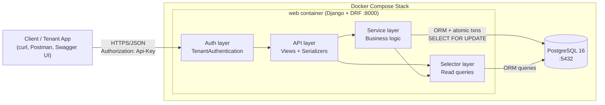
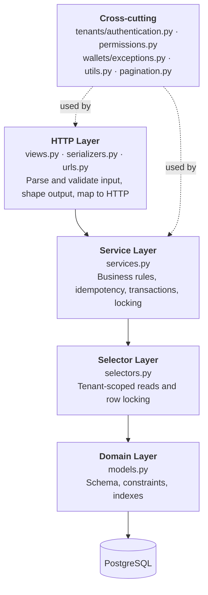
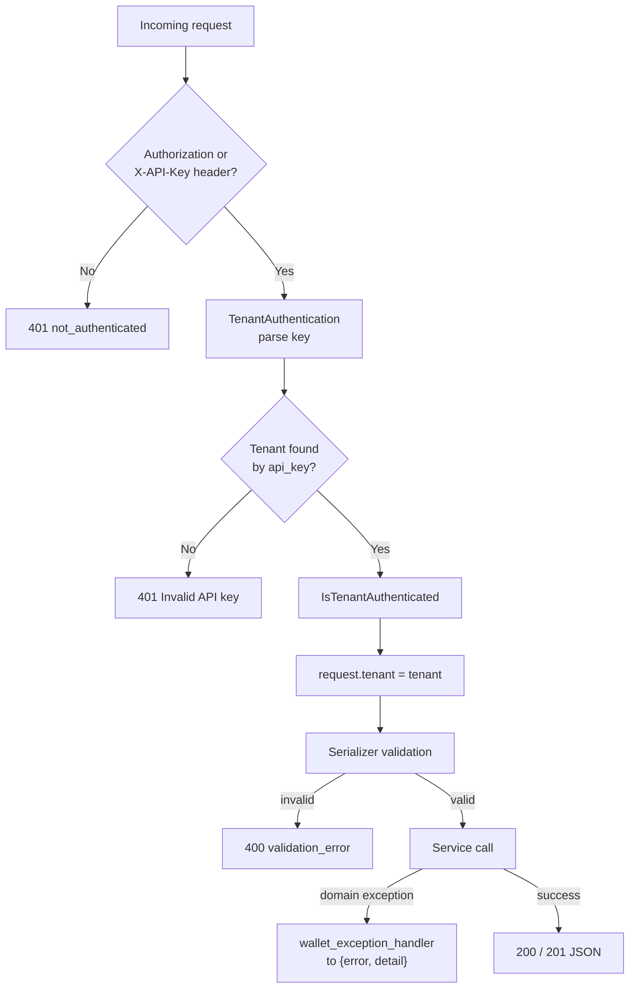
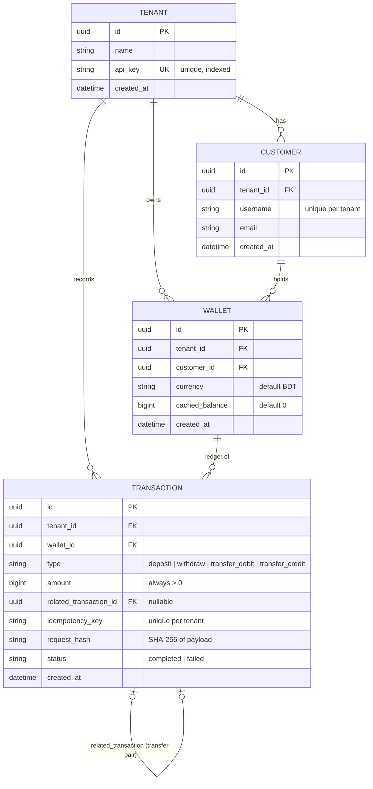
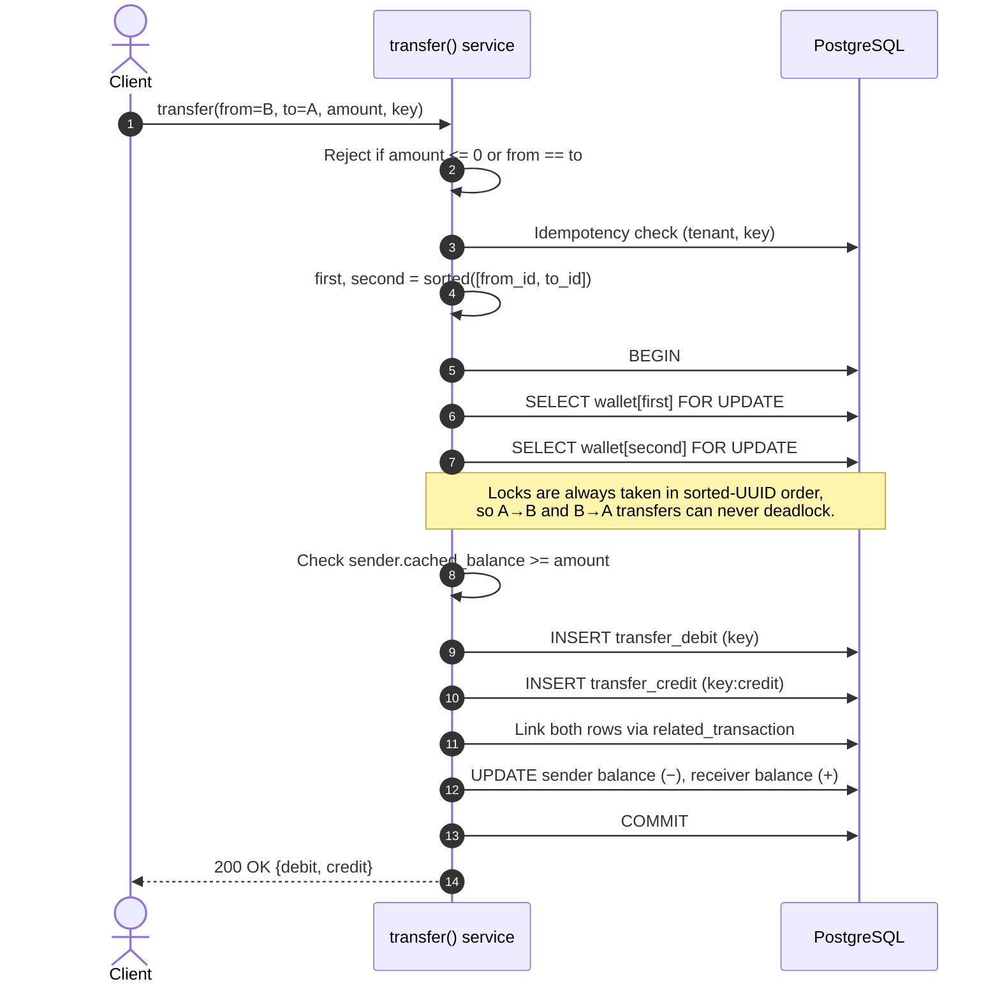
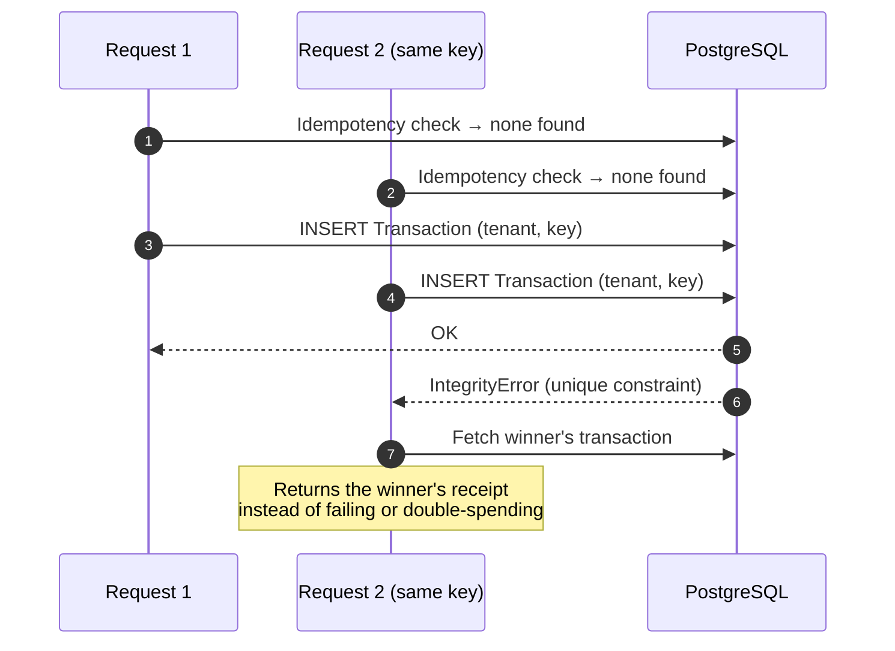

# 💳 Cashless Wallet API

A **multi-tenant digital wallet REST API** built with **Django 5 + Django REST Framework** and **PostgreSQL**.

Each *tenant* is an isolated organisation with its own customers and wallets. The API supports creating customers, depositing, withdrawing, transferring between wallets, and reading balances and paginated transaction history. Every money-moving operation is **idempotent**, **concurrency-safe**, **atomic** and **tenant-scoped**.


---

## 📑 Table of Contents

1. [Features](#-features)
2. [Tech Stack](#-tech-stack)
3. [Quick Start](#-quick-start)
4. [System Architecture](#-system-architecture)
5. [Project Structure](#-project-structure)
6. [Data Model (ER Diagram)](#-data-model-er-diagram)
7. [Request Flows (Sequence Diagrams)](#-request-flows-sequence-diagrams)
8. [Design Decisions & Guarantees](#-design-decisions--guarantees)
9. [API Reference](#-api-reference)
10. [Try It: Walkthrough with curl](#-try-it-walkthrough-with-curl)
11. [Configuration](#-configuration)
12. [Testing](#-testing)
13. [Trade-offs & Assumptions](#-trade-offs--assumptions)
14. [Troubleshooting](#-troubleshooting)
15. [Possible Future Improvements](#-possible-future-improvements)

---

## ✨ Features

| Feature | Description |
| :--- | :--- |
| **Multi-tenancy** | Every customer, wallet and transaction belongs to a tenant. Every query is filtered by the authenticated tenant. |
| **API-key authentication** | Tenants authenticate with `Authorization: Api-Key <key>`. |
| **Idempotent mutations** | `deposit`, `withdraw` and `transfer` require an idempotency key. Replays are safe; payload mismatches return `409`. |
| **Concurrency safety** | Row-level locks (`SELECT ... FOR UPDATE`) with deterministic lock ordering prevent overdrafts and deadlocks. |
| **Atomic transfers** | Debit, credit and balance updates succeed or fail together in one DB transaction. |
| **Append-only ledger** | Transactions are immutable records. `cached_balance` gives O(1) balance reads. |
| **Strict validation** | Amounts must be positive integers (no floats, no numeric strings) up to PostgreSQL `bigint` max. |
| **Cursor pagination** | Stable, newest-first transaction history that scales without `OFFSET` scans. |
| **Uniform errors** | Every error uses the shape `{ "error": "code", "detail": ... }`. |
| **Interactive docs** | Swagger UI and ReDoc generated by `drf-spectacular`. |
| **Dockerised** | One command starts PostgreSQL and the API, with migrations applied automatically. |

---

## 🧰 Tech Stack

| Layer | Technology |
| :--- | :--- |
| Language | Python 3.11 |
| Web framework | Django 5.2, Django REST Framework 3.15 |
| Database | PostgreSQL 16 (via `psycopg2-binary`) |
| API docs | `drf-spectacular` (OpenAPI 3 / Swagger UI / ReDoc) |
| Config | `python-decouple` (`.env` file or environment variables) |
| Containers | Docker, Docker Compose |
| Code style | `black`, `isort` |

---

## 🚀 Quick Start

### Option 1: Docker (recommended)

**Prerequisites:** [Docker](https://docs.docker.com/get-docker/) with Docker Compose.

```bash
# 1. Clone the repository
git clone https://github.com/Ranger-DRAX/cashlessAi-assesment.git
cd cashlessAi-assesment

# 2. Build and start PostgreSQL + the API (migrations run automatically)
docker compose up --build
```

When you see `Starting server on 0.0.0.0:8000...`, the API is ready:

| URL | What it is |
| :--- | :--- |
| <http://localhost:8000/api/> | API root (service info) |
| <http://localhost:8000/api/docs/> | Swagger UI (interactive) |
| <http://localhost:8000/api/redoc/> | ReDoc |
| <http://localhost:8000/api/schema/> | Raw OpenAPI schema |

To stop: `Ctrl+C`, then `docker compose down` (add `-v` to also delete the database volume).

### Option 2: Local setup (without Docker)

**Prerequisites:** Python 3.11+ and a running PostgreSQL server.

```bash
# 1. Clone the repository
git clone https://github.com/Ranger-DRAX/cashlessAi-assesment.git
cd cashlessAi-assesment

# 2. Create and activate a virtual environment
python -m venv venv
# Windows (PowerShell):  venv\Scripts\Activate.ps1
# Windows (cmd):         venv\Scripts\activate
# macOS / Linux:         source venv/bin/activate

# 3. Install dependencies
pip install -r requirements.txt

# 4. Create the database
psql -U postgres -c "CREATE DATABASE cashless_wallet;"

# 5. Configure environment variables
cp .env.example .env        # Windows: copy .env.example .env
# Edit .env and set DB_PASSWORD (and DJANGO_SECRET_KEY outside of local dev)

# 6. Apply migrations
python manage.py migrate

# 7. Run the development server
python manage.py runserver
```

The API is now available at <http://localhost:8000/api/>.

### Verify the installation

```bash
curl http://localhost:8000/api/
```

You should get JSON describing the service, its version and its documentation URL.

---

## 🏗 System Architecture

### High-level overview



### Layered design

The code follows a **Views → Services → Selectors → Models** layering so each concern has one home:



| Layer | Responsibility | Files |
| :--- | :--- | :--- |
| **HTTP** | Validates payloads, calls services, formats responses. Contains no business rules. | [`wallets/views.py`](wallets/views.py), [`wallets/serializers.py`](wallets/serializers.py) |
| **Services** | All writes: idempotency checks, balance rules, atomic transactions, lock ordering. | [`wallets/services.py`](wallets/services.py) |
| **Selectors** | Reads. Always tenant-scoped; provides the locking variant (`select_for_update`). | [`wallets/selectors.py`](wallets/selectors.py) |
| **Models** | Data schema and DB-level constraints. | [`wallets/models.py`](wallets/models.py), [`tenants/models.py`](tenants/models.py) |
| **Auth** | Resolves the `Api-Key` header to a tenant. | [`tenants/authentication.py`](tenants/authentication.py), [`tenants/permissions.py`](tenants/permissions.py) |
| **Errors** | Maps domain exceptions to a uniform JSON error contract. | [`wallets/exceptions.py`](wallets/exceptions.py) |

### Authentication & request lifecycle



---

## 📁 Project Structure

```text
cashlessAi-assesment/
├── config/                    # Django project configuration
│   ├── settings.py            # Settings (env-driven via python-decouple)
│   ├── urls.py                # Root URLs, OpenAPI/Swagger/ReDoc routes
│   ├── wsgi.py / asgi.py
├── tenants/                   # Tenant & authentication app
│   ├── models.py              # Tenant (id, name, api_key)
│   ├── authentication.py      # TenantAuthentication (Api-Key header)
│   ├── permissions.py         # IsTenantAuthenticated
│   ├── views.py               # POST /api/tenants/, GET /api/tenants/ping/
│   └── tests/
├── wallets/                   # Wallet domain app
│   ├── models.py              # Customer, Wallet, Transaction
│   ├── views.py               # Thin HTTP controllers
│   ├── serializers.py         # Strict input validation
│   ├── services.py            # Business logic (deposit/withdraw/transfer)
│   ├── selectors.py           # Tenant-scoped reads and row locks
│   ├── exceptions.py          # Domain exceptions + DRF exception handler
│   ├── pagination.py          # Cursor pagination
│   ├── utils.py               # Request payload hashing
│   └── tests/                 # Unit, integration, concurrency + E2E script
├── Dockerfile
├── docker-compose.yml         # PostgreSQL + web
├── entrypoint.sh              # Runs migrations, then starts the server
├── requirements.txt
├── .env.example
└── manage.py
```

---

## 🗄 Data Model (ER Diagram)



### Database constraints

| Constraint | Table | Purpose |
| :--- | :--- | :--- |
| `unique_customer_per_tenant` (`tenant`, `username`) | Customer | Usernames are unique within a tenant, not globally. |
| `unique_idempotency_key_per_tenant` (`tenant`, `idempotency_key`) | Transaction | The DB-level guard that makes idempotency race-proof. |
| `transaction_amount_positive` (`amount > 0`) | Transaction | Direction comes from `type`, so amounts are never negative or zero. |
| `on_delete=PROTECT` on every FK | all | Financial records can't be cascade-deleted. |
| `UUID` primary keys | all | Non-guessable IDs; safe to expose in URLs. |

### Transaction types

| `type` | Wallet effect | Created by |
| :--- | :--- | :--- |
| `deposit` | `+amount` | `POST /wallets/{id}/deposit/` |
| `withdraw` | `-amount` | `POST /wallets/{id}/withdraw/` |
| `transfer_debit` | `-amount` on the sender | `POST /wallets/transfer/` |
| `transfer_credit` | `+amount` on the receiver | `POST /wallets/transfer/` |

The two rows of a transfer point at each other through `related_transaction`. The credit row's idempotency key is stored as `<key>:credit`.

---

## 🔄 Request Flows (Sequence Diagrams)

### Deposit / Withdraw

```mermaid
sequenceDiagram
    autonumber
    actor C as Client
    participant V as View + Serializer
    participant S as Service
    participant DB as PostgreSQL

    C->>V: POST /api/wallets/{id}/deposit/ {amount, idempotency_key}
    V->>V: Validate (strict integer, key present)
    V->>V: request_hash = SHA-256(payload + wallet_id)
    V->>S: deposit(tenant, wallet_id, amount, key, hash)
    S->>DB: SELECT txn WHERE (tenant, key)
    alt Key exists, same hash
        DB-->>S: existing txn
        S-->>C: 200 OK (original receipt, replay)
    else Key exists, different hash
        S-->>C: 409 idempotency_key_conflict
    else New key
        S->>DB: BEGIN
        S->>DB: SELECT wallet FOR UPDATE (tenant-scoped)
        S->>DB: INSERT Transaction
        S->>DB: UPDATE wallet.cached_balance
        S->>DB: COMMIT
        S-->>C: 200 OK (new receipt)
    end
```



For `withdraw`, the service also checks `cached_balance >= amount` after taking the row lock and returns `402 insufficient_funds` if it fails.

### Transfer (deadlock-safe, atomic)



If any step fails, the whole database transaction rolls back and no partial transfer is ever stored.

### Idempotency race (two simultaneous identical requests)



---

## 🛡 Design Decisions & Guarantees

### 1. Idempotency

All mutating endpoints require a key, sent as the JSON field `idempotency_key` **or** the `Idempotency-Key` HTTP header (max 255 characters).

| Scenario | Result |
| :--- | :--- |
| New key | Operation executes, returns the receipt. |
| Same key, same payload | Original receipt returned with `200 OK`; **no second effect**. |
| Same key, different payload | `409 Conflict` (`idempotency_key_conflict`). |
| Two simultaneous requests, same key | One wins; the other catches `IntegrityError` and returns the winner's receipt. |

Payload equality is determined by a **SHA-256 `request_hash`** of the validated payload (plus `wallet_id` for deposit/withdraw).

### 2. Concurrency & deadlock prevention

- `withdraw` and `transfer` read the wallet with `SELECT ... FOR UPDATE` inside `transaction.atomic()`, so concurrent overdraw attempts are serialised.
- `transfer` locks **both** wallets in **sorted UUID order**, which eliminates the classic A→B / B→A circular-wait deadlock.

### 3. Tenant isolation

- Every selector filters by `tenant`.
- Wallets that don't exist **or** belong to another tenant both return the same `404 wallet_not_found`, preventing resource enumeration across tenants.
- Transfers are limited to wallets of the **same tenant**.

### 4. Money handling

- Amounts are **integers** (smallest currency unit), stored in `BigIntegerField`. There is no floating-point rounding.
- `StrictIntegerField` rejects `100.5`, `"100"`, `true` and values above the PostgreSQL `bigint` maximum (`9,223,372,036,854,775,807`) with `400`.

### 5. Ledger integrity

- `Transaction` rows are never updated or deleted by the application (aside from linking transfer pairs at creation).
- Invariant: for every wallet, `sum(credits) − sum(debits) == cached_balance`. The test suite checks this.

---

## 📡 API Reference

**Base URL:** `http://localhost:8000/api`

**Authentication:** send `Authorization: Api-Key <your_api_key>` on every endpoint except `POST /tenants/`.
(Fallback headers `X-API-Key` / `X-Tenant-Key` / `X-Tenant-ID` are also accepted.)

| Method | Endpoint | Auth | Description |
| :--- | :--- | :---: | :--- |
| `POST` | `/tenants/` | ❌ | Register a tenant; returns the `api_key`. |
| `GET` | `/tenants/ping/` | ✅ | Verify your API key; returns tenant info. |
| `POST` | `/customers/` | ✅ | Create a customer and a default BDT wallet (balance 0). |
| `POST` | `/wallets/{id}/deposit/` | ✅ | Deposit funds (idempotent). |
| `POST` | `/wallets/{id}/withdraw/` | ✅ | Withdraw funds (idempotent; `402` if insufficient). |
| `POST` | `/wallets/transfer/` | ✅ | Atomically move funds between two wallets (idempotent). |
| `GET` | `/wallets/{id}/balance/` | ✅ | Current balance and currency. |
| `GET` | `/wallets/{id}/transactions/` | ✅ | Cursor-paginated history, newest first (page size 20). |
| `GET` | `/docs/` · `/redoc/` · `/schema/` | ❌ | Swagger UI, ReDoc, OpenAPI schema. |

### Request bodies

```jsonc
// POST /tenants/
{ "name": "My Company" }

// POST /customers/
{ "username": "alice", "email": "alice@example.com" }

// POST /wallets/{id}/deposit/   and   /withdraw/
{ "amount": 5000, "idempotency_key": "dep-001" }

// POST /wallets/transfer/
{
  "from_wallet_id": "<uuid>",
  "to_wallet_id": "<uuid>",
  "amount": 1200,
  "idempotency_key": "xfer-001"
}
```

### Example responses

```jsonc
// Deposit / Withdraw → 200
{
  "id": "…", "wallet_id": "…", "type": "deposit", "amount": 5000,
  "related_transaction_id": null, "idempotency_key": "dep-001",
  "status": "completed", "created_at": "2026-01-01T10:00:00Z"
}

// Transfer → 200
{ "debit": { "...": "transfer_debit transaction" },
  "credit": { "...": "transfer_credit transaction" } }

// Balance → 200
{ "wallet_id": "…", "balance": 3800, "currency": "BDT" }

// Transactions → 200 (cursor pagination)
{ "next": "http://…?cursor=…", "previous": null, "results": [ { "...": "…" } ] }
```

### Error contract

Every error, including validation errors, has the same shape:

```json
{ "error": "snake_case_code", "detail": "Human-readable message or validation detail object" }
```

| Status | `error` code | Trigger |
| :---: | :--- | :--- |
| 400 | `invalid_amount` | Amount ≤ 0 |
| 400 | `same_wallet_transfer` | `from_wallet_id == to_wallet_id` |
| 400 | `validation_error` | Serializer failure (bad type, missing field, duplicate username, …) |
| 401 | `not_authenticated` | Missing or invalid API key |
| 402 | `insufficient_funds` | Balance < requested withdrawal / transfer |
| 404 | `wallet_not_found` | Wallet doesn't exist or belongs to another tenant |
| 404 | `customer_not_found` | Customer doesn't exist for this tenant |
| 404 | `not_found` | Unknown `/api/...` route |
| 409 | `idempotency_key_conflict` | Same key reused with a different payload |

---

## 🧪 Try It: Walkthrough with curl

> On Windows PowerShell, use `curl.exe` instead of `curl`, or use the Swagger UI at <http://localhost:8000/api/docs/> (click **Authorize** and paste `Api-Key <your_key>`).

```bash
BASE=http://localhost:8000/api

# 1. Create a tenant → copy "api_key" from the response (shown only once)
curl -s -X POST $BASE/tenants/ -H "Content-Type: application/json" \
  -d '{"name": "My Company"}'

export KEY="paste_api_key_here"
AUTH="Authorization: Api-Key $KEY"

# 2. Create two customers (each gets a wallet; note the wallet_id values)
curl -s -X POST $BASE/customers/ -H "$AUTH" -H "Content-Type: application/json" \
  -d '{"username": "alice", "email": "alice@example.com"}'
curl -s -X POST $BASE/customers/ -H "$AUTH" -H "Content-Type: application/json" \
  -d '{"username": "bob", "email": "bob@example.com"}'

export ALICE="alice_wallet_id"
export BOB="bob_wallet_id"

# 3. Deposit 5000 into Alice's wallet
curl -s -X POST $BASE/wallets/$ALICE/deposit/ -H "$AUTH" \
  -H "Content-Type: application/json" \
  -d '{"amount": 5000, "idempotency_key": "dep-001"}'

# 4. Replay the same request → same receipt, balance unchanged
curl -s -X POST $BASE/wallets/$ALICE/deposit/ -H "$AUTH" \
  -H "Content-Type: application/json" \
  -d '{"amount": 5000, "idempotency_key": "dep-001"}'

# 5. Transfer 1200 from Alice to Bob
curl -s -X POST $BASE/wallets/transfer/ -H "$AUTH" \
  -H "Content-Type: application/json" \
  -d "{\"from_wallet_id\": \"$ALICE\", \"to_wallet_id\": \"$BOB\", \"amount\": 1200, \"idempotency_key\": \"xfer-001\"}"

# 6. Check balances (Alice 3800, Bob 1200) and history
curl -s $BASE/wallets/$ALICE/balance/ -H "$AUTH"
curl -s $BASE/wallets/$BOB/balance/ -H "$AUTH"
curl -s $BASE/wallets/$ALICE/transactions/ -H "$AUTH"
```

---

## ⚙️ Configuration

Settings are read from environment variables or a `.env` file (see [`.env.example`](.env.example)).

| Variable | Default | Description |
| :--- | :--- | :--- |
| `DJANGO_SECRET_KEY` | `insecure-dev-key-change-me` | Django secret key. **Change in production.** |
| `DJANGO_DEBUG` | `True` | Debug mode. Set `False` in production. |
| `DJANGO_ALLOWED_HOSTS` | `localhost,127.0.0.1` | Comma-separated allowed hosts. |
| `DB_NAME` | `cashless_wallet` | PostgreSQL database name. |
| `DB_USER` | `postgres` | Database user. |
| `DB_PASSWORD` | `postgres` | Database password. |
| `DB_HOST` | `localhost` | Database host (`postgres` inside Docker Compose). |
| `DB_PORT` | `5432` | Database port. |

Docker Compose sets these for you; no `.env` file is needed when using Docker.

---

## ✅ Testing

The project ships with three layers of verification.

### 1. Django unit & integration tests

Runs against an isolated, auto-created test database (no running server needed).

```bash
# Local
python manage.py test -v 2

# Docker
docker compose exec web python manage.py test -v 2
```

Test modules live in [`wallets/tests/`](wallets/tests) and [`tenants/tests/`](tenants/tests). The suite covers:

| Category | What is verified |
| :--- | :--- |
| Functional | Full lifecycle with balance asserted after every step |
| Validation | Bad inputs return `4xx`, never `500` |
| Tenant isolation | Every endpoint, across tenants |
| Authentication | Missing / wrong / malformed credentials → `401` |
| Idempotency | Replay, conflict, cross-tenant key reuse |
| Concurrency | Overdraw races, opposing simultaneous transfers (no deadlock) |
| Atomicity | Injected failures roll back the whole operation |
| Ledger integrity | Ledger sum equals `cached_balance`; money is conserved |
| Pagination | Stable ordering, cursor navigation, no duplicates |
| Error contract | Every error path returns `{error, detail}` |

### 2. Live end-to-end script

With the server running, execute the zero-dependency (standard-library only) E2E script:

```bash
# From the host (against http://localhost:8000)
python wallets/tests/E2echeck.py

# Optional flags
python wallets/tests/E2echeck.py --base-url http://localhost:8000
python wallets/tests/E2echeck.py --skip-concurrency

# Inside Docker
docker compose exec web python wallets/tests/E2echeck.py
```

Exit codes: `0` = all passed · `1` = a check failed · `2` = script could not run (server unreachable).

### 3. Coverage report

```bash
pip install coverage
coverage run manage.py test
coverage report
coverage html          # open htmlcov/index.html
```

---

## ⚖️ Trade-offs & Assumptions

### `cached_balance` vs. always summing the ledger

`cached_balance` is a denormalised column alongside the immutable `Transaction` ledger so that balance reads are O(1). The cost is that both must change in the **same `transaction.atomic()` block**. If they ever disagree, the ledger is the source of truth and the balance can be recomputed.

### Idempotency-key scope

Keys are unique **per tenant** (`UniqueConstraint(tenant, idempotency_key)`), not globally. Two tenants may use the same key string without colliding. Keys need not be UUIDs; short strings like `"dep-001"` work as long as the client keeps them unique within its own tenant.

### Cursor vs. page-number pagination

The ledger is append-only, so cursor pagination is stable: a deposit arriving between page 1 and page 2 won't shift rows, and it avoids `OFFSET N` scans on large tables.

### One wallet per customer (for now)

`POST /customers/` creates exactly one default `BDT` wallet. The schema allows multiple wallets per customer (FK is `Wallet → Customer`), so extending this later needs no migration of existing data.

### `request_hash`

A SHA-256 of the validated payload lets the server tell an identical retry (safe replay) from a reused key with different data (`409`), without storing the payload itself.

### Single currency

All wallets are `BDT`. There is no currency conversion; amounts are integers in the smallest unit.

---

## 🩺 Troubleshooting

| Problem | Fix |
| :--- | :--- |
| `port is already allocated` (5432 or 8000) | Another service uses the port. Stop it, or change the host port mapping in [`docker-compose.yml`](docker-compose.yml). |
| `connection refused` to PostgreSQL (local run) | Ensure PostgreSQL is running and `DB_HOST`/`DB_PORT`/`DB_USER`/`DB_PASSWORD` in `.env` are correct. |
| `database "cashless_wallet" does not exist` | Run `psql -U postgres -c "CREATE DATABASE cashless_wallet;"`. |
| `401 not_authenticated` | Use the header exactly: `Authorization: Api-Key <key>`. |
| API key lost | It's only returned once on tenant creation. Create a new tenant. |
| `entrypoint.sh: not found` / `\r` errors on Windows | The Dockerfile already strips CRLF; rebuild with `docker compose up --build`. |
| Start over with a clean database | `docker compose down -v && docker compose up --build`. |

---

## 🔭 Possible Future Improvements

- Production server (`gunicorn`/`uvicorn`) instead of `runserver` in the Docker image
- Hash API keys at rest and support key rotation
- Rate limiting and request logging/observability
- Multi-currency wallets and additional wallets per customer
- Background reconciliation job (ledger vs `cached_balance`)
- CI pipeline (lint + tests) on every push
